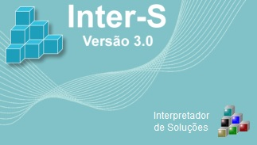
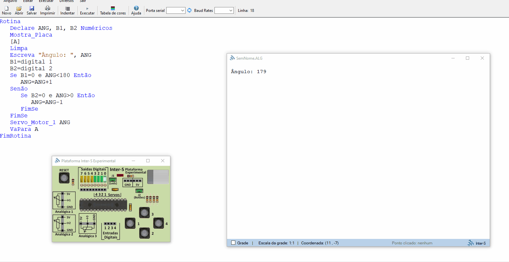

<h1 align="center">
  
   
  Servo Motor Command
</h1>

<h3 align="justify">
Didactic demonstration of an application with Inter-s logic for manipulating a servo motor. Prototyping of integrated hardware and software solutions. Credits to Professor Vichinsky and Cruzeiro do Sul University, Electrical Engineering course.
</h3>

 

## 📷 Demonstration

<h4 align="left"></h4>
  

 

## 🚀 Technologies

This project was developed with the following technologies:

- Inter-s

## ⚙ Sources and Documentation
- https://www.vichinsky.com.br/pags/main.htm
- https://www.vichinsky.com.br/inters/PIE_Apresentacao.pdf

 

Made with 💜 by Rafael Maciel
